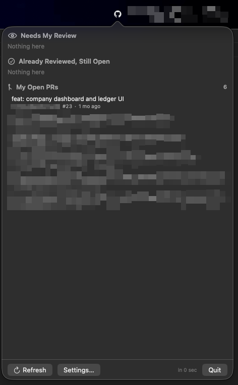

# gh-badge

A menu bar app that tells you how many pull requests are waiting on **you**.

GitHub dumps every PR, mention, and notification into one unreadable pile.
gh-badge pulls out the single number that actually matters and puts it in your
menu bar — then gives you one click to see the rest.

> **3** — a little GitHub cat in your menu bar, with a count next to it.

## The number that matters

The badge shows **open PRs that need your review** — nothing else. Not total
notifications, not "someone mentioned you", just the work sitting on your desk.

Click it and you get three tidy lists:

- **Needs My Review** — PRs asking for you
- **Already Reviewed, Still Open** — you've looked, they're still in flight
- **My Open PRs** — yours, so you can see where they stand

## Why you'll like it

- **No passwords, no tokens, no keychain fiddling.** It rides on
  [`gh`](https://cli.github.com), the GitHub CLI you probably already use. You
  log in the same way you already did, once. gh-badge never stores or touches
  your credentials.
- **Nothing leaves your machine.** Every request goes through `gh` to GitHub —
  no third-party API, no analytics, no telemetry.
- **Built for teams, not just you.** Need review from a whole team
  (`your-org/your-team`)? gh-badge understands team review requests.
- **Tiny and dependency-free.** One small binary. No Electron, no half-gigabyte
  runtime, no account to sign up for.
- **Light and dark, automatically.** The icon adapts to your menu bar like a
  good macOS citizen.

## See it in action



## Install

You'll need macOS 13 (Ventura) or later and the GitHub CLI:

```sh
brew install gh
gh auth login
```

Then:

```sh
git clone https://github.com/oliviergerdi/gh-badge.git
cd gh-badge
./build.sh --install --run
```

That's it. The badge appears in your menu bar. Flip on **Launch at login** in
Settings and it'll be waiting for you every morning.

## Make it yours

Everything is opt-in and adjustable in **Settings**:

- **Watch only the repos you care about** — it starts quiet, you add what matters
- **Ignore PRs older than** an hour, a day, a week — hide the stale stuff
- **Refresh every** 1, 2, 5, or 10 minutes
- **Teams** — include PRs requested from a whole team
- **Launch at login**

## The fine print

- gh-badge is **open source** and free. It's a personal tool I built for myself
  and decided to share.
- It's **macOS only**, on purpose.
- Want to hack on it? Head over to [`CONTRIBUTING.md`](CONTRIBUTING.md).

## License

[MIT License](LICENSE) — do what you want with it, just keep the copyright and
permission notice in any copies.
