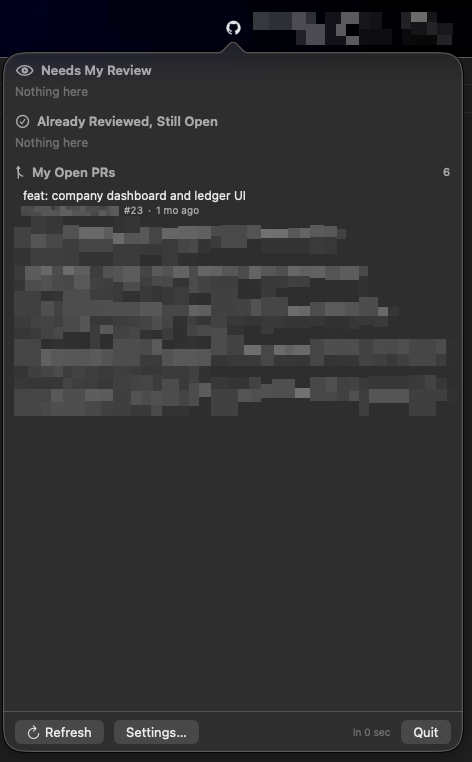

# gh-badge

A menu bar app that tells you how many pull requests are waiting on **you**.

GitHub dumps every PR, mention, and notification into one unreadable pile.
gh-badge pulls out the single number that actually matters and puts it in your
menu bar — then gives you one click to see the rest.

> **3** — a little GitHub cat in your menu bar, with a count next to it.

## The number that matters

The badge shows **open PRs that need your review** — nothing else. Not total
notifications, not "someone mentioned you", just the work sitting on your desk.

Click it and you get three tidy lists:

- **Needs My Review** — PRs asking for you
- **Already Reviewed, Still Open** — you've looked, they're still in flight
- **My Open PRs** — yours, so you can see where they stand

## Why you'll like it

- **No passwords, no tokens, no keychain fiddling.** It rides on
  [`gh`](https://cli.github.com), the GitHub CLI you probably already use. You
  log in the same way you already did, once. gh-badge never stores or touches
  your credentials.
- **Nothing leaves your machine.** Every request goes through `gh` to GitHub —
  no third-party API, no analytics, no telemetry.
- **Built for teams, not just you.** Need review from a whole team
  (`your-org/your-team`)? gh-badge understands team review requests.
- **Tiny and dependency-free.** One small binary. No Electron, no half-gigabyte
  runtime, no account to sign up for.
- **Light and dark, automatically.** The icon adapts to your menu bar like a
  good macOS citizen.
- **Recovers on its own.** A network blip or a flaky `gh` call retries
  automatically with backoff, instead of leaving a stale error up until the
  next scheduled refresh or a manual click.
- **Remembers what you've already looked at.** Open a PR and its row dims;
  a new commit or comment on it brings it back to full brightness on its own.
- **Flags what's new.** When a PR lands in Needs My Review, the icon pulses
  and briefly shows "NEW" so you don't have to keep re-checking by hand.

## See it in action



## Install

You'll need macOS 13 (Ventura) or later and the GitHub CLI:

```sh
brew install gh
gh auth login
```

Then:

```sh
git clone https://github.com/oliviergerdi/gh-badge.git
cd gh-badge
./build.sh --install --run
```

That's it. The badge appears in your menu bar. Flip on **Launch at login** in
Settings and it'll be waiting for you every morning.

## Updating

There's no auto-update — gh-badge is a local build, not something distributed
through an App Store or a package manager. To pick up the latest changes:

1. Quit gh-badge — click the badge and hit **Quit** in the dropdown, or
   right-click it for the same option in the context menu.
2. Pull the latest source:
   ```sh
   cd gh-badge
   git pull
   ```
3. Rebuild and reinstall:
   ```sh
   ./build.sh --install --run
   ```

`build.sh` overwrites the copy in `/Applications` and relaunches it, so your
settings (they live in `UserDefaults`, not the app bundle) carry over untouched.

## Make it yours

Everything is opt-in and adjustable in **Settings**:

- **Watch only the repos you care about** — it starts quiet, you add what matters
- **Teams** — include PRs requested from a whole team, not just you personally
- **Show all of my own open PRs, ignoring the whitelist** — so My Open PRs
  always reflects everything you have in flight, watched or not
- **Ignored authors** — hide PRs from specific logins in the review sections
  (`dependabot[bot]` is ignored by default; doesn't touch My Open PRs)
- **Show draft pull requests** — off by default; drafts stay out of Needs My
  Review and Already Reviewed until you opt in
- **Show author name** on each PR line — free, since it's already fetched
- **Show branch name** on each PR line — costs one extra GitHub API call per
  refresh, only made while this is on
- **Ignore PRs older than** an hour, a day, a week — hide the stale stuff
- **Refresh every** 1, 2, 5, or 10 minutes
- **Launch at login**

## The fine print

- gh-badge is **open source** and free. It's a personal tool I built for myself
  and decided to share.
- It's **macOS only**, on purpose.
- Want to hack on it? Head over to [`CONTRIBUTING.md`](CONTRIBUTING.md).

## License

[MIT License](LICENSE) — do what you want with it, just keep the copyright and
permission notice in any copies.
